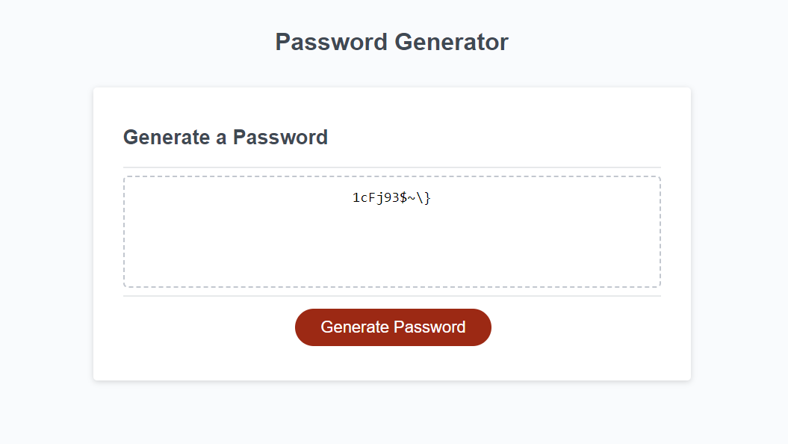

# Password Generator
This is a password generator website. Here is the deployed website link → https://lunar-potato.github.io/password-generator/

## Description
This website allows users to get a strong generated password of at least 10 characters long. This password generation offers options for users
to pick for their passwords to have a combination of letters, numbers, symbols, etc. This password generator ensures that the given password is strong and unique which reduces
risk of vulnerability in the event of a hack.

## About
This password generator was created in HTML, CSS, and JavaScript programming languages. HTML and CSS is used to create the homepage and the design of the website and the logic behind
the password generator is created with JavaScript. 

## Instructions
To generate a password, click on the **"Generate Password"** button to get an alert on top of the page asking the user the length of the password that they desire. After the length alert, there will be a series of confirmation asking the user if they fancy their password to either have lower case, upper case, special, or numerical characters in their password. After asking for the password options and getting the confirmations over, a password will be generated according to user requirement.

## Usage
This password generator can be used for personal use to get strong generated passwords for accounts and this can also be used to see the logic behind password generators. 

## License 
License is under MIT. Please refer to the LICENSE in the repository. Thank you.